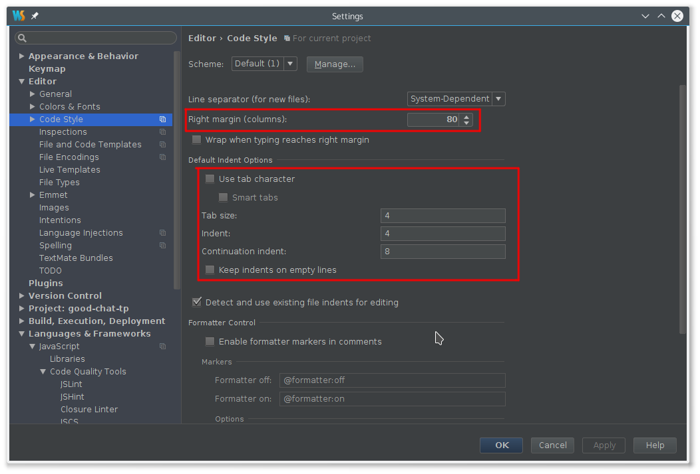
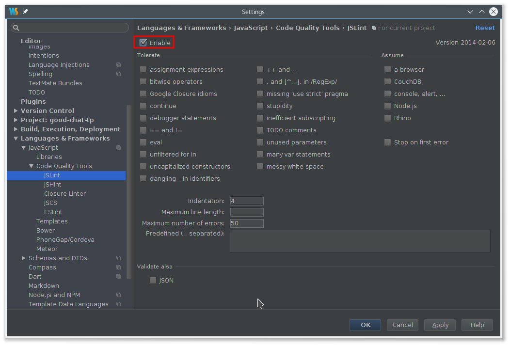
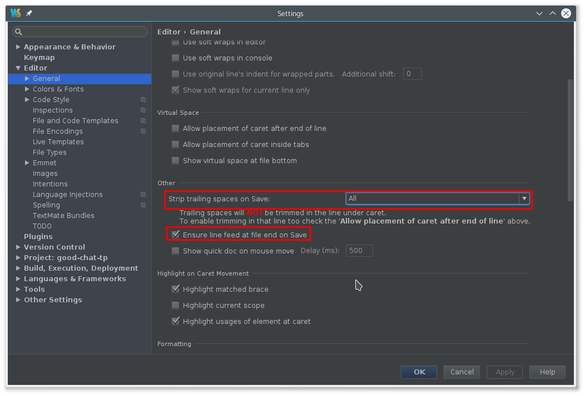
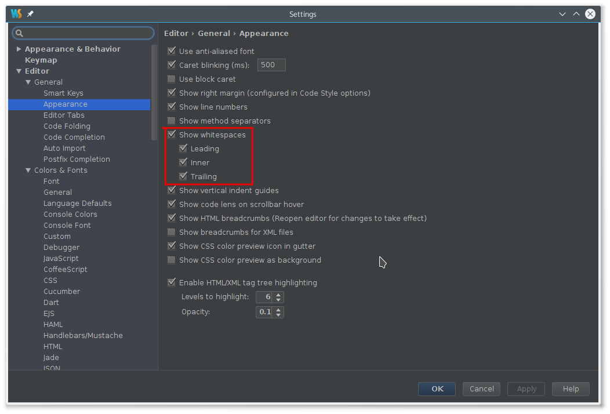
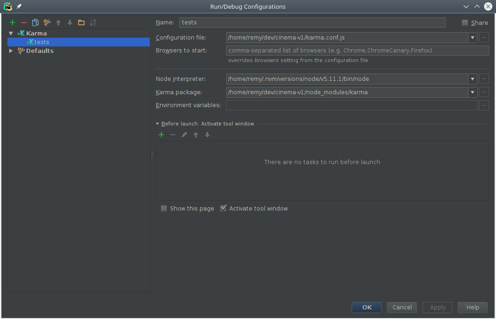

Partie&nbsp;1&nbsp;&mdash; Les outils
=====================================

Nous allons nous intéresser à la mise en place des outils de travail.
Comme vous re-prendrez le travail de vos collègues, il faut que vous
fassiez bien attention à&nbsp;:

- Utiliser des machines de l'université
- Configurer votre environnement à l'identique de tout le monde

Nous allons dérouler deux phases. La première est la configuration des
outils de base tandis que la deuxième est la mise en place du nécessaire
pour faire des tests unitaires.

## Outils

### IDE

Vous devez configurer PhpStorm de manière cohérente avec le reste de 
l’équipe. Pour cela, vous devez vérifier que la configuration correspond 
aux screenshots suivants.

Il s'agit des paramètres qui permettent d'appliquer les consignes de
la présentation.









### Git

Si ce n'est pas encore le cas, pensez à versionner votre code dans Git.

Par ailleurs, veuillez à ce que le dépôt Git soit bien configuré dans
l'IDE.

## Linting

Maintenant que JSLint est activé, veuillez formatter correctement votre
code pour que JSLint n'affiche **aucun** warning et **sans** désactiver
de warnings.

## Tests unitaires

Nous utiliserons pour les tests unitaires ces outils qui s'articulent
ensemble

- [karma](https://karma-runner.github.io/1.0/index.html)&nbsp;&mdash;
  Le *runner* de tests. Il met en place l'environnement de test et
  les exécutes.
- [jasmine](https://jasmine.github.io/)&nbsp;&mdash; le framework de
  tests unitaires.
- [angular-mocks](https://docs.angularjs.org/api/ngMock)&nbsp;&mdash; un
  supplément à Angular pour faciliter l'écriture de tests unitaires.
- [phantomjs](http://phantomjs.org/)&nbsp;&mdash; un navigateur *sans
  tête* pour faire tourner les tests.
  
### Installation

```
npm install --save-dev karma karma-jasmine jasmine-core karma-phantomjs-launcher
```
  
### Configuration de Karma

La première étape est de configurer Karma.

Depuis la racine de votre projet&nbsp;:

```
node_modules/karma/bin/karma init karma.conf.js
```

Quand il vous demandera quel navigateur vous souhaitez capturer, dites
`PhantomJS`. Pour les autres questions, laissez par défaut.

### Configuration des tests dans l'IDE

Créer une *Run Configuration* de type `Karma`. Elle devrait ressembler
à cela



Une fois que cette configuration est faite, vous pouvez cliquer sur
 pour lancer les tests. Tout devrait s'afficher
au vert.

### Premier test

Nous allons créer un premier test simple pour valider le fonctionnement
des tests unitaires. Pour cela, créer dans votre projet un fichier
`tests/test.js`.

Pensez à lui donner la forme recommendée par JSLint&nbsp;:

```javascript
(function () {
    'use strict';
    
    // Put your code here
}());
```

Il faut penser à ajouter ce fichier à la liste `files` trouvée dans
`karma.conf.js`.

Vous aurez besoin d'une fonction à tester. Vous pouvez coder la fonction
[factorielle](https://fr.wikipedia.org/wiki/Factorielle) directement
dans `test.js`.

Pour rappel,

```
fac(0) = 1
fac(1) = 1
fac(2) = 1 * 2
fac(3) = 1 * 2 * 3
fac(4) = 1 * 2 * 3 * 4
...
```

Comment valider que cette fonction fonctionne&nbsp;? À l'aide du test
unitaire suivant&nbsp;:

```javascript
  function fac(n) {
    // Your code here
  }

  describe('Factorial', function () {
    it('returns the right values', function () {
      expect(fac(0)).toBe(1);
      expect(fac(1)).toBe(1);
      expect(fac(2)).toBe(2);
      expect(fac(3)).toBe(6);
      expect(fac(4)).toBe(24);
      expect(fac(5)).toBe(120);
      expect(fac(6)).toBe(720);
      expect(fac(7)).toBe(5040);
      expect(fac(8)).toBe(40320);
      expect(fac(9)).toBe(362880);
      expect(fac(10)).toBe(3628800);
    });
  });
```

À l'aide de ce test unitaire.

Une fois que ce test unitaire passe, développez une fonction `sum(a, b)`
qui retourne la somme de deux nombres (entiers ou flotants) puis le test
unitaire appriorié.
