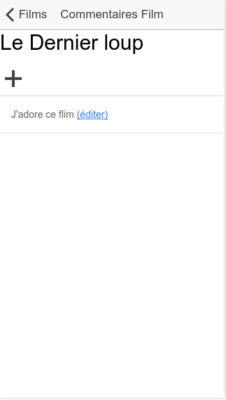

Partie&nbsp;3&nbsp;&mdash; Ajout d'une story
============================================

Dans cette partie, votre client a décidé qu'en plus d'autoriser les
utilisateurs à laisser des commentaires, ils doivent être en mesure de
les modifier.

Pour cela, il faut ajouter un lien à côté du commentaire. Par
exemple&nbsp;:

La popup d'édition sera sensiblement la même que la popup d'ajout. Il
faut donc veiller à ce que ces deux éléments partagent le même code. Il
est **impensable** de copier/coller le code, cela créerait une 
duplication de code et augmenterait la complexité de maintenance.

Vous allez donc

1. Constater qu'un test unitaire valide bien le fonctionnement de 
   l'ajout de commentaire
2. Développer la nouvelle fonctionnalité
3. Constater que l'ancienne fonctionnalité fonctionne toujours à l'aide
   du test unitaire
4. Mettre en place un test unitaire pour la nouvelle fonctionnalité
